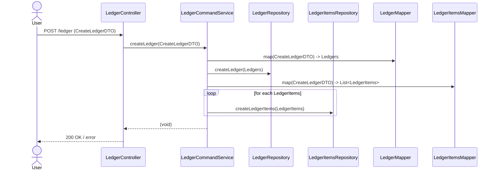
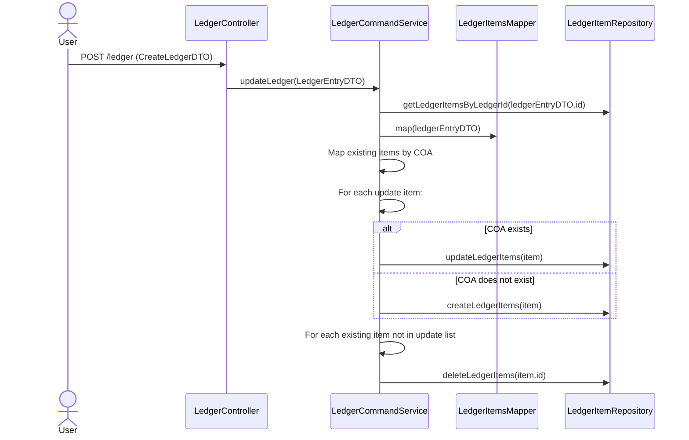

# SpringBoot_CQRS_Command

## Table Of Content
1. [Run Process](#run-process)
2. [Development Process](#development-process)
3. [Design Document](#design-document)
4. [Highlight Functionality](#highlight-functionality)

## Run Process with Docker
```bash
#1 Prepare directory and clone from github
git clone https://github.com/Thee5176/SpringBoot_CQRS_Command.git
cd SpringBoot_CQRS_Command

#2 Run DB Container and make migration
docker compose up test_command_postgres -d
chmod +x mvnw
./mvnw flyway:migrate

#3  Build pakcage and run process with docker
./mvnw clean package
docker compose up -d --build

```
Check the running project at [port 8185](http://localhost:8186)

## Development Process
see [Main Repository](https://github.com/Thee5176/Accounting_CQRS_Project)

## Design Document


# Highlight Functionality

## Springboot Command Service

| Feature                      | Description                                                                                                                                                                               | Reference Link                                                                                                                                                         |
|-----------------------------|-------------------------------------------------------------------------------------------------------------------------------------------------------------------------------------------|----------------------------------------------------------------------------------------------------------------------------------------------------------------------|
| Custom Object Mapper         | Configure ModelMapper Beans to customize field mapping between DTO and two Domain Entities                                                                                                | [ModelMapperConfig.java](https://github.com/Thee5176/SpringBoot_CQRS_Command/blob/develop/src/main/java/com/thee5176/ledger_command/Application/config/ModelMapperConfig.java) |
| Double Input Validation Logic| - **BalanceCheck**: Validate if sum of "amount" per "balanceType" matches (via custom validation class comparing with BigDecimal.ZERO)<br>- **Unique "Code of Account" Check**: Ensure no duplicates in LedgerItems list using DTO method + Hibernate UniqueElements | - [BalanceCheckValidator.java](https://github.com/Thee5176/SpringBoot_CQRS_Command/blob/develop/src/main/java/com/thee5176/ledger_command/Application/validation/BalanceCheckValidator.java)<br>- [LedgersEntryDTO.java - unique COA](https://github.com/Thee5176/SpringBoot_CQRS_Command/blob/develop/src/main/java/com/thee5176/ledger_command/Application/dto/LedgersEntryDTO.java#L37) |
| Transaction Management      | - **Create Transaction**: Manage create entity transaction incl. aggregated entities<br>- **Replacement Update Transaction**: Upsert logic via Java Stream for update/create/delete steps | - [Create Transaction](https://github.com/Thee5176/SpringBoot_CQRS_Command/blob/develop/src/main/java/com/thee5176/ledger_command/Domain/service/LedgerCommandService.java#L33)<br>- [Update Transaction](https://github.com/Thee5176/SpringBoot_CQRS_Command/blob/develop/src/main/java/com/thee5176/ledger_command/Domain/service/LedgerCommandService.java#L56) |

### Sequence Diagrams for Transaction Management

**Create Transaction**


**Replacement Update Transaction**

## Test Result:
- Unit Test Coverage(JUnit): 
  ✔ ModelMapper
  
  

  ✔ DTO
  


Integration Test(Mockito):
  ✔ Service - Create Transaction
  ✘ Service - Update Transaction

API Test Case:
  ✔ Validation
  
  
  

  
  ✔ RestAPI Controller
  
